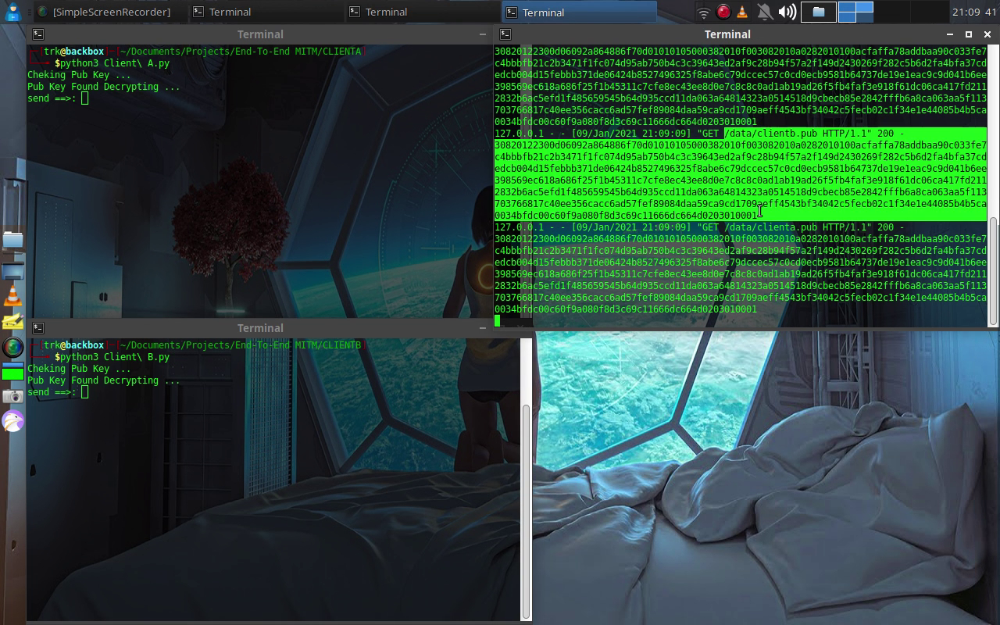

# MITM-E2EE
Man-in-the-middle of End-to-end encryption demonstration

## Intro
E2EE Is one of the most secure method of commenication
and a lot of companys Gov's uses it and control it
but what if These Company/Gov or Attackers wan't to use it to monitor Users 
How They Will Do it MITM Seems good But How

## Server
The Purpose Of A server is to Send The First Public Key Extchange And Encrypted MSG Transfer

**Normal Server** Does That 

**Evil Server** Does What an Attacker Do ,it Changes The Client's Public Key with It's Public Key During Key Extchange

## Client A & B
Is A Simple Client With RSA Public/Private 

Client **A** Send'd **Public Key A** to Client **B**

Client **B** Send'd **Public Key B** to Client **A**

Then Each Client Encrypts The Message With Other Client Public Key And Send's It 

## DEMO

